# ReviveAI

<p align="center">
  <strong>Autonomous revenue recovery agent for Indian merchants</strong><br/>
  Detect → Diagnose → Intervene → Recover
</p>

<p align="center">
  
  
  
  
  
  
  
</p>

---

## Table of Contents

1. [What is ReviveAI?](#what-is-reviveai)
2. [The Problem](#the-problem)
3. [Architecture](#architecture)
4. [The Recovery Pipeline](#the-recovery-pipeline)
5. [Detection Engine](#detection-engine)
6. [Strategy Selection](#strategy-selection)
7. [Guardrails](#guardrails)
8. [Interventions](#interventions)
9. [Two-Way Recovery](#two-way-recovery)
10. [Voice Outreach](#voice-outreach)
11. [Promise Tracking & Escalation](#promise-tracking--escalation)
12. [Churn Prevention](#churn-prevention)
13. [Tuning Council](#tuning-council)
14. [What-If Simulator](#what-if-simulator)
15. [Fleet View](#fleet-view)
16. [Measurement & Reporting](#measurement--reporting)
17. [Tech Stack](#tech-stack)
18. [Getting Started](#getting-started)
19. [Environment Variables](#environment-variables)
20. [Scripts](#scripts)
21. [Project Structure](#project-structure)
22. [Dashboard Pages](#dashboard-pages)
23. [API Reference](#api-reference)
24. [Database Schema](#database-schema)
25. [Authentication & Tenancy](#authentication--tenancy)
26. [Data Flow Diagrams](#data-flow-diagrams)
27. [Testing](#testing)
28. [Observability](#observability)
29. [Security](#security)
30. [Contributing](#contributing)
31. [License](#license)

---

## What is ReviveAI?

ReviveAI is an **AI-powered revenue recovery platform** for Indian merchants. It automatically detects revenue leaks (failed payments, abandoned checkouts, failed subscriptions, and overdue invoices), diagnoses the root cause, chooses the right intervention, and executes recovery through Razorpay. Every decision the agent makes is **auditable, guardrail-bounded, and human-reviewable**.

### Core Capabilities

| # | Capability | What it does |
|---|-----------|--------------|
| 1 | **Detection** | 4 deterministic detectors classify failures by root cause with confidence scoring |
| 2 | **Diagnosis** | Confidence-based routing picks intervene / escalate / skip / no-action |
| 3 | **Guardrails** | 19 rules across retry, time, compliance, financial, voice, and promise categories |
| 4 | **Recovery** | Razorpay integration in live or simulated mode |
| 5 | **Governance** | Human-in-the-loop Tuning Council for guardrail adjustments |
| 6 | **What-If Console** | 5 sliders, instant re-simulation, baseline vs scenario |
| 7 | **Two-Way Recovery** | Hinglish intent classification, dispute escalation, chat-parsed promises |
| 8 | **Churn Prevention** | Risk scoring on healthy customers *before* failures occur |
| 9 | **Fleet View** | Per-merchant economics + fairness check at scale |
| 10 | **Multi-Channel Outreach** | Voice, WhatsApp, SMS, and email notifications |

---

## The Problem

Indian merchants lose **8-15% of annual revenue** to recoverable failures:

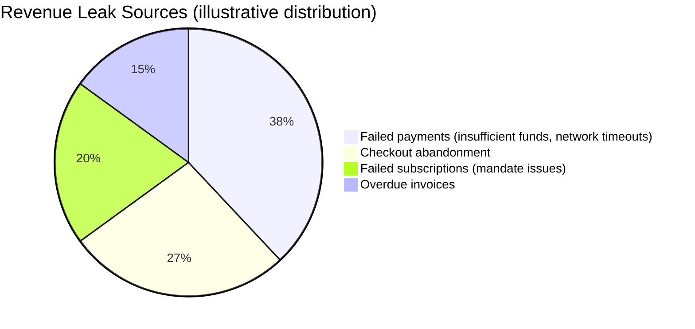

Each leak has a short recovery window. A customer who hit "insufficient funds" this morning is far more likely to pay tonight than next week, but the typical merchant has no automated way to act inside that window, and manual follow-up doesn't scale across thousands of customers.

ReviveAI closes that gap: it continuously watches for failures and intervenes **while the window is open**, inside hard limits that keep outreach compliant and customer-friendly.

---

## Architecture

ReviveAI is a Next.js 16 App Router application. Pages are React Server Components backed by direct database access; API routes handle mutations, batch execution, and webhooks.

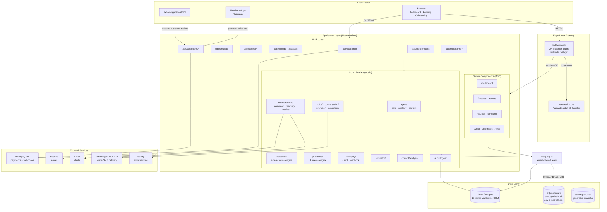

### Repository Layout at a Glance

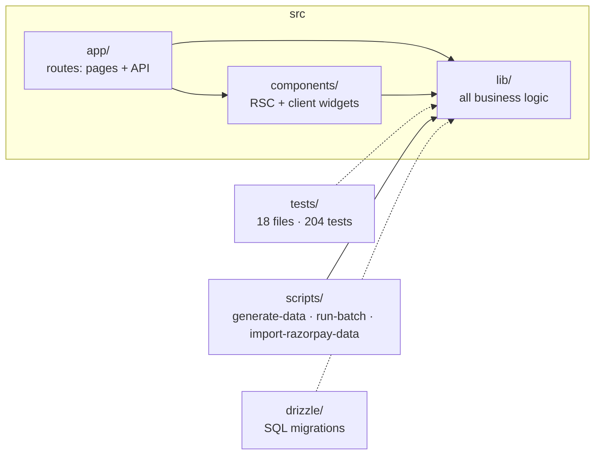

---

## The Recovery Pipeline

Every record flows through the same deterministic pipeline. The agent never acts without passing detection, strategy, and guardrails first.

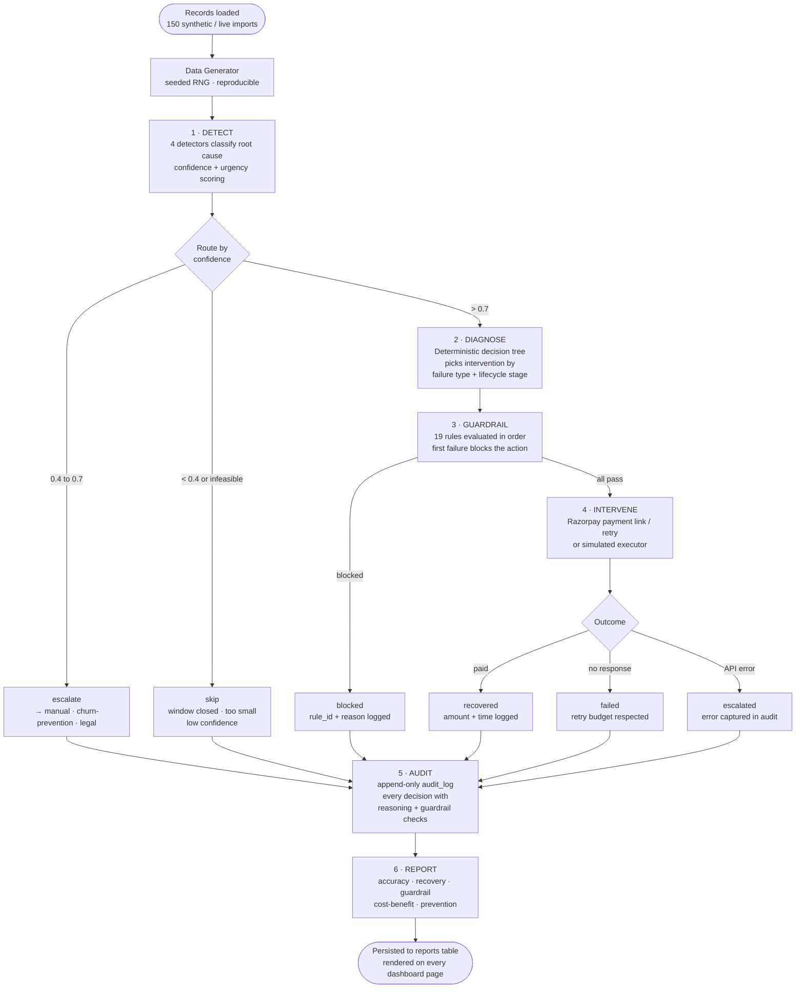

### End-to-End Sequence

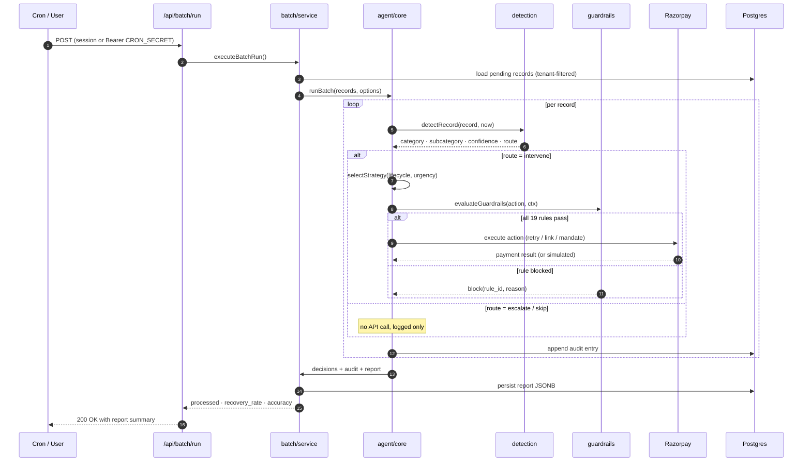

---

## Detection Engine

Four detectors classify each record by root cause. Detection is **deterministic and explainable** (no black boxes), with an urgency score and confidence-based routing on top.

| Detector | Input record type | Key signals |
|----------|------------------|-------------|
| `detectPaymentFailure` | `payment_failure` | failure reason → subcategory (insufficient funds, network timeout, fraud hold, expired card…), recency, customer history |
| `detectSubscriptionFailure` | `subscription_failure` | mandate lifecycle stage, retry window, amount |
| `detectCheckoutAbandonment` | `checkout_abandonment` | time since cart creation, urgency window (minutes-hours) |
| `detectOverdueInvoice` | `overdue_invoice` | aging bucket (7/14/30 day late), invoice amount, B2B segment |

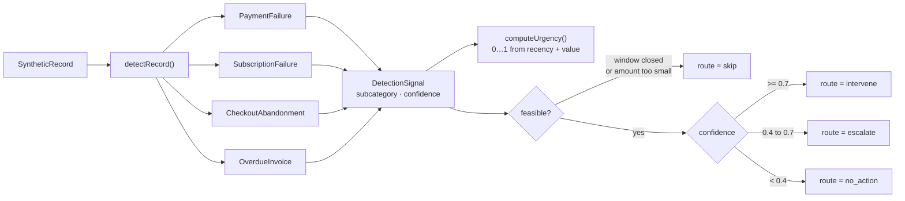

**Routing thresholds** (from `src/lib/detection/types.ts`):

| Route | Condition | Meaning |
|-------|-----------|---------|
| `intervene` | confidence ≥ 0.7 | act autonomously |
| `escalate` | 0.4 ≤ confidence < 0.7 | human review |
| `skip` | infeasible (window closed, amount too small) or unclassifiable | do nothing |
| `no_action` | control-group / healthy customers | track only |

---

## Strategy Selection

Once routed to intervene, a deterministic decision tree maps failure type + lifecycle stage to one of **18 strategy actions**:

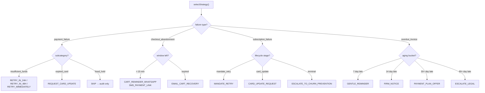

All 18 actions (`StrategyAction` in `src/lib/agent/strategy.ts`):

`RETRY_IN_24H` · `RETRY_IN_48H` · `RETRY_IMMEDIATELY` · `REQUEST_CARD_UPDATE` · `ESCALATE_TO_MANUAL` · `SKIP` · `CART_REMINDER_WHATSAPP` · `SMS_PAYMENT_LINK` · `EMAIL_CART_RECOVERY` · `MANDATE_RETRY` · `CARD_UPDATE_REQUEST` · `ESCALATE_TO_CHURN_PREVENTION` · `GENTLE_REMINDER` · `FIRM_NOTICE` · `PAYMENT_PLAN_OFFER` · `ESCALATE_LEGAL` · `PREVENT_CARD_UPDATE` · `NO_ACTION`

---

## Guardrails

19 rules bound every intervention. They are evaluated in a fixed order and the **first failure blocks the action** with a machine-readable reason. All agent behavior is subject to them, including the simulator.

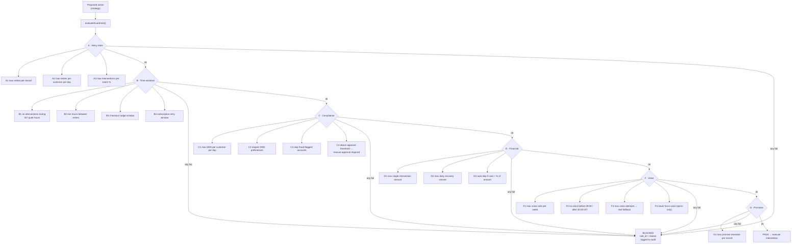

| Category | Rules | Purpose |
|----------|-------|---------|
| **A · Retry** | A1, A2, A3 | Cap retries per record / customer / batch |
| **B · Time** | B1-B4 | Quiet hours, cooldowns, intervention windows |
| **C · Compliance** | C1-C4 | SMS limits, DND, fraud flags, approval thresholds |
| **D · Financial** | D1-D3 | Amount caps, daily volume, cost-efficiency |
| **F · Voice** | F1-F4 | Weekly call caps, calling hours, opt-in respect |
| **G · Promise** | G1 | Promise renewal limits |

Every guardrail parameter lives in `GuardrailConfig` (e.g. `maxRetriesPerRecord`, `cooldownHours`, `checkoutNudgeWindowHours`, `approvalThresholdPaise`). Values can be tuned via the Council (see below) and are **hard-capped** so no approval can set unbounded values.

---

## Interventions

Actions are executed through a `RazorpayExecutor` abstraction, so the same code path runs live or simulated:

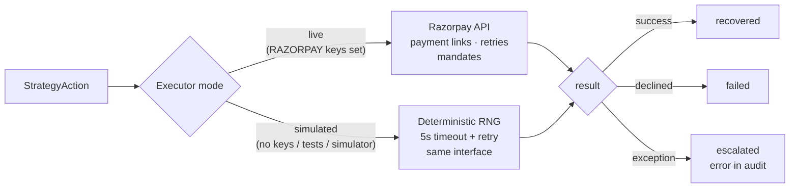

- **Live mode:** real API calls with 5-second timeouts and per-call retry.
- **Simulated mode:** used by tests, the What-If console, and any environment without Razorpay keys. Outputs are statistically realistic (RNG-driven) but never touch the network.
- **Webhook ingestion:** `payment.failed`, `subscription.failed`, `invoice.expired`, `payment.captured`, `refund.*` events are mapped into the records table (see [Webhooks](#api-reference)).

---

## Two-Way Recovery

Recovery isn't just outbound. Customers reply, and the conversation engine classifies intent and resolves accordingly.

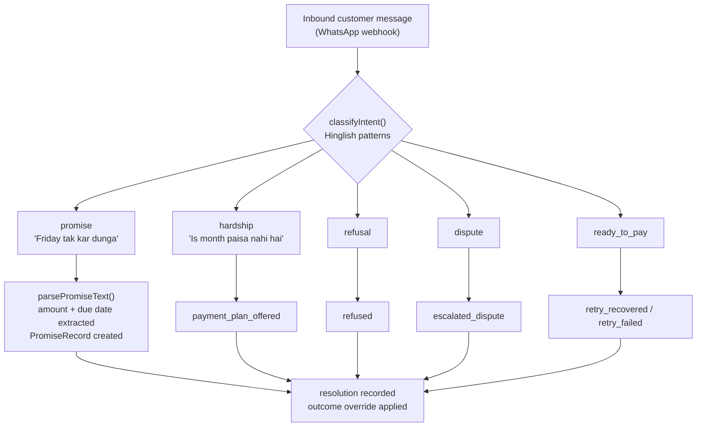

**Intents:** `promise` · `hardship` · `refusal` · `dispute` · `ready_to_pay`
**Resolutions:** `promise_created` · `promise_noted_existing` · `payment_plan_offered` · `refused` · `escalated_dispute` · `retry_recovered` · `retry_failed` · `unresolved_manual`

A `promise` intent feeds `parsePromiseText`, which extracts amount and due date from free-form Hinglish ("₹25000 Monday se pehle") and creates a tracked promise with its own escalation ladder.

---

## Voice Outreach

Voice is the highest-touch channel, so it has its own strategy layer plus four dedicated guardrails (F1-F4):

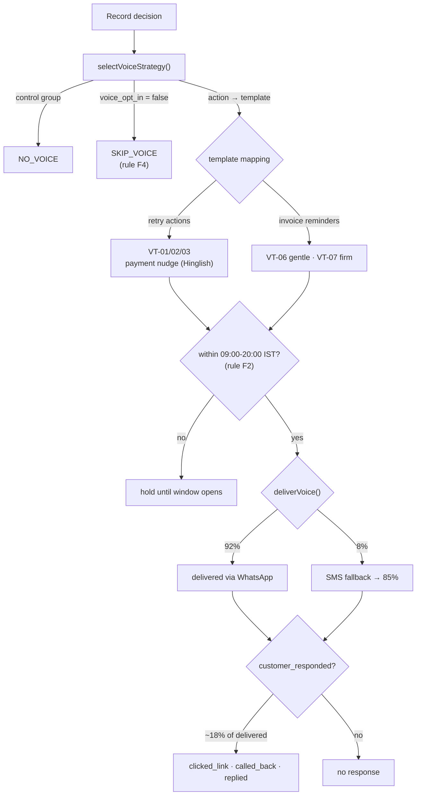

- 7 Hinglish templates (`VT-01`…`VT-07`) covering payment nudges, cart reminders, and invoice escalations.
- The dashboard `/voice` page renders every template with a **Web Speech API preview** so reviewers can hear the script without a TTS provider.
- Delivery is simulated by default (`simulated-tts-v1`); metrics (delivery rate, response rate, recovery via voice) are computed in `lib/voice/tracker.ts`.

---

## Promise Tracking & Escalation

When a customer promises to pay, the promise gets its own lifecycle:

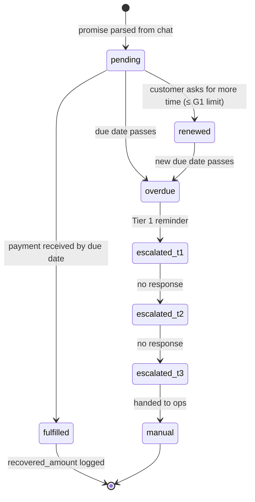

`parsePromiseText` extracts `{amount, due_date}` from free text; `processPromises` advances state on each batch; `escalationTier` returns the current tier and next action. Renewals are capped by guardrail **G1**.

---

## Churn Prevention

Prevention runs *before* failures happen, scoring currently-healthy customers by risk:

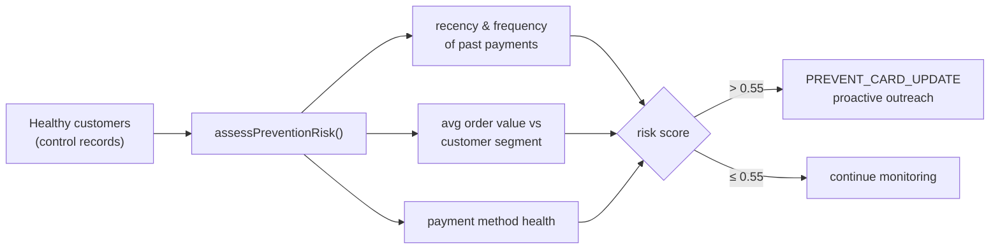

Escalation to `ESCALATE_TO_CHURN_PREVENTION` (from terminal subscription failures) also lands in this flow. The threshold (`PREVENTION_SCORE_THRESHOLD = 0.55`) is a constant, documented, and tested.

---

## Tuning Council

The Council is ReviveAI's **human-in-the-loop governance layer**. The agent proposes, humans decide, and rejected proposals are remembered so the agent never re-proposes the same change.

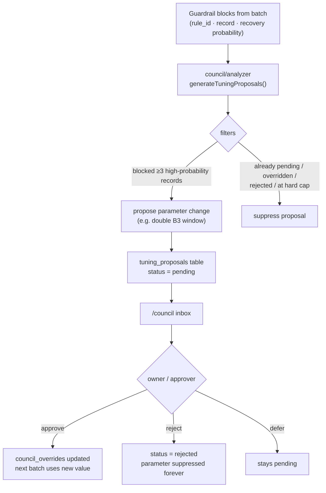

Proposal rules enforced by tests:

- A rule that blocked **≥ 1 record with avg recovery probability > 0.5** generates a proposal (zero-probability blocks never do).
- Parameters with a pending proposal, an active override, a prior rejection, or at their hard cap are **never re-proposed**.
- Approved overrides are picked up by the next batch automatically via `resolveGuardrailConfig`.

---

## What-If Simulator

The simulator re-runs the exact production pipeline (same detectors, same guardrails, same strategy tree) against configurable overrides, so operators can measure the impact of a guardrail change **before** asking the Council for it.

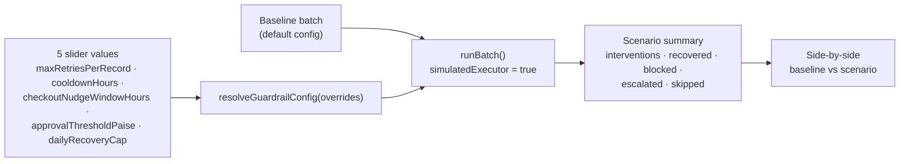

Because the executor is simulated and the RNG is seeded, results are **deterministic**: same inputs always produce the same comparison, and `clampOverrides` enforces the same hard caps the Council respects.

---

## Fleet View

The fleet page aggregates per-merchant economics and checks for fairness across the portfolio:

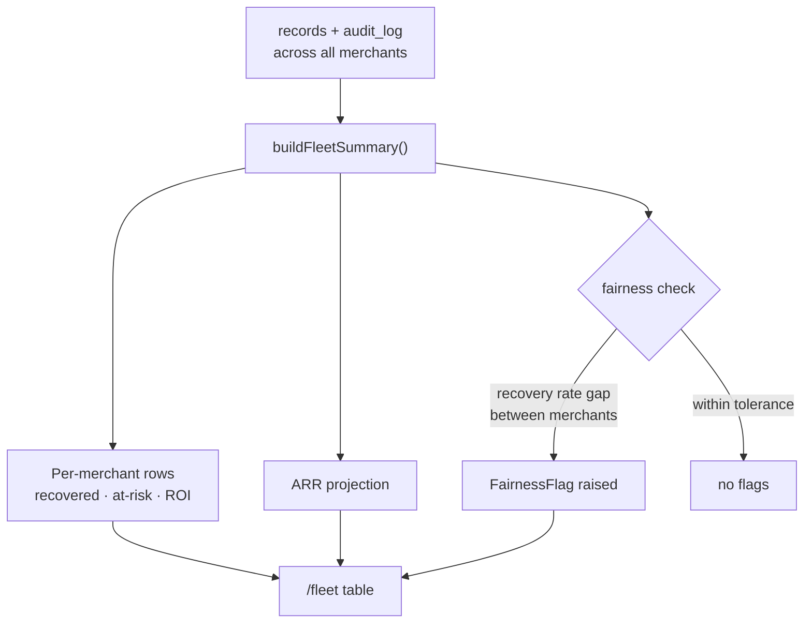

---

## Measurement & Reporting

Every batch produces a full report persisted as JSONB and rendered across the dashboard:

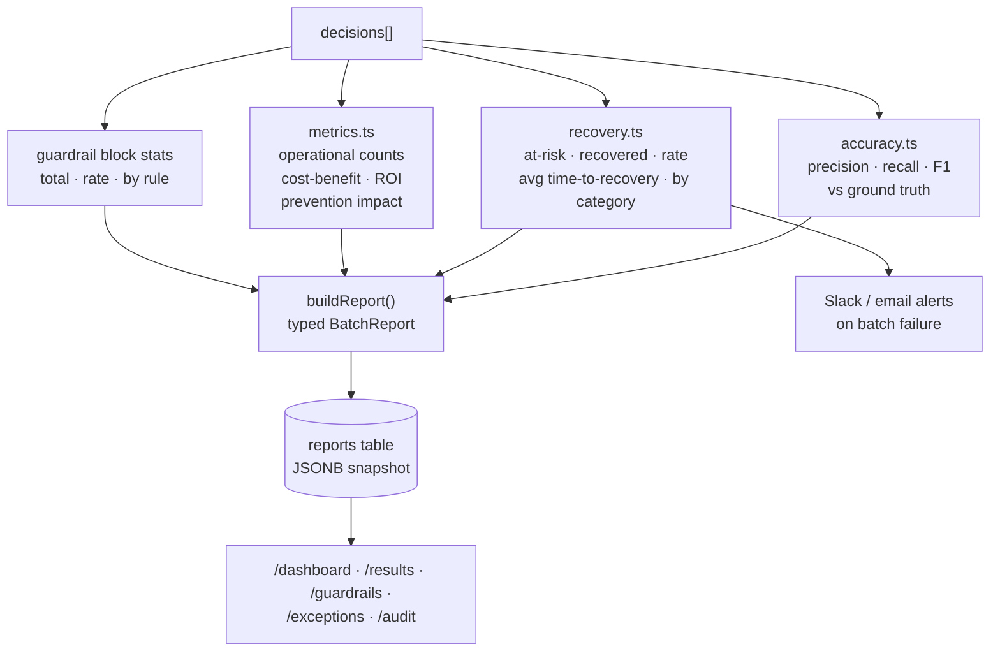

Metrics include: hero numbers (recovered ₹, at-risk ₹, recovery rate %, ROI), accuracy vs ground truth (the synthetic dataset ships with labeled ground truth), guardrail block rate and per-rule breakdown, exceptions (what the agent couldn't handle), and prevention impact.

---

## Tech Stack

| Layer | Technology | Notes |
|-------|-----------|-------|
| Framework | Next.js 16 (App Router, Turbopack) | React 19, RSC-first |
| Language | TypeScript (strict) | `tsc --noEmit` in CI |
| Database | Neon Postgres | serverless Postgres |
| ORM | Drizzle ORM + drizzle-kit | typed schema, SQL migrations |
| Auth | Auth.js v5 | Google OAuth + credentials |
| Styling | Tailwind CSS v4 | PostCSS pipeline |
| State | Zustand | client-side stores |
| Testing | Vitest | 18 files, 204 tests |
| Logging | pino | structured JSON logs |
| Errors | Sentry | server + edge configs |
| Payments | Razorpay | live + simulated modes |
| Email | Resend | transactional + alerts |
| Chat | WhatsApp Cloud API | inbound replies, outbound voice/SMS |
| Alerts | Slack incoming webhooks | batch failure notifications |
| Deployment | Vercel | cron via `vercel.json` |

---

## Getting Started

### Prerequisites

- Node.js 18+ (CI runs Node 22)
- npm
- A Neon Postgres database (or any Postgres), *optional*: the app falls back to a local SQLite fixture without it
- Google OAuth credentials, *optional*

### Installation

```bash
git clone https://github.com/Samyra312007/ReviveAI.git
cd ReviveAI
npm install
```

### Environment Setup

```bash
cp .env.local.example .env.local
```

### Database Setup

```bash
# Generate migration (only if you changed the schema)
npm run db:generate

# Run migrations
npm run db:migrate

# Seed SQLite fixture with synthetic data (always works, no DB needed)
npm run generate-data
```

### Development

```bash
npm run dev
```

Open [http://localhost:3000](http://localhost:3000).

> **No Postgres?** The app runs in **file-only mode**: `src/lib/db/index.ts` provisions a local SQLite database (`data/synthetic.db`) with the same schema, and every query layer transparently falls back to it. This is how tests stay hermetic.

### First Batch Run

```bash
npm run run-batch
```

This loads records, runs the full pipeline (detect → diagnose → guardrail → intervene → audit), and prints the report: recovery rate, accuracy, guardrail blocks, and per-category breakdown.

---

## Environment Variables

All variables are optional except where noted; the app degrades gracefully (simulated delivery, file-only storage) when integrations are absent.

### Core

| Variable | Required | Description |
|----------|----------|-------------|
| `DATABASE_URL` | | Postgres connection string. Absent ⇒ SQLite fixture mode |
| `AUTH_SECRET` | Yes | Secret for JWT session signing |
| `AUTH_URL` | | Canonical app URL for Auth.js |
| `CRON_SECRET` | | Bearer token required by `/api/cron/process` |

### OAuth

| Variable | Description |
|----------|-------------|
| `GOOGLE_CLIENT_ID` | Google OAuth client ID (optional provider) |
| `GOOGLE_CLIENT_SECRET` | Google OAuth client secret |

### Payments

| Variable | Description |
|----------|-------------|
| `RAZORPAY_KEY_ID` | Razorpay API key. Absent ⇒ simulated executor |
| `RAZORPAY_KEY_SECRET` | Razorpay key secret |
| `RAZORPAY_WEBHOOK_SECRET` | Verifies webhook signatures (HMAC-SHA256) |

### Notifications & Alerts

| Variable | Description |
|----------|-------------|
| `RESEND_API_KEY` | Resend API key for transactional email |
| `RESEND_FROM_EMAIL` | Verified sender address |
| `ALERT_EMAIL` | Recipient for batch alerts |
| `SLACK_WEBHOOK_URL` | Slack incoming webhook for batch alerts |
| `WHATSAPP_ACCESS_TOKEN` | WhatsApp Cloud API token |
| `WHATSAPP_PHONE_NUMBER_ID` | WhatsApp sender phone number ID |

### Observability

| Variable | Description |
|----------|-------------|
| `NEXT_PUBLIC_SENTRY_DSN` | Sentry DSN (server + edge). Absent ⇒ Sentry disabled |

> Tests blank these variables (see `vitest.config.ts`) so the suite never leaks credentials or fires real network calls.

---

## Scripts

| Command | Description |
|---------|-------------|
| `npm run dev` | Start dev server |
| `npm run build` | Production build |
| `npm run start` | Start production server |
| `npm run lint` | Run ESLint (must be error-free in CI) |
| `npm run typecheck` | TypeScript checking (`tsc --noEmit`) |
| `npm test` | Run test suite (auto-generates data first) |
| `npm run generate-data` | Generate synthetic dataset → SQLite + report |
| `npm run run-batch` | Execute a recovery batch end-to-end |
| `npm run db:generate` | Generate Drizzle migrations |
| `npm run db:migrate` | Run database migrations |
| `npm run db:studio` | Open Drizzle Studio |

---

## Project Structure

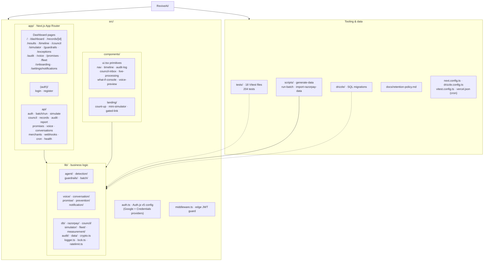

Key entry points:

| Path | Role |
|------|------|
| `src/app/page.tsx` | Public landing page |
| `src/auth.ts` | Auth.js v5: Google OAuth + credentials, role & merchant claims in the JWT |
| `src/middleware.ts` | Edge-compatible session guard for all protected routes |
| `src/lib/agent/core.ts` | The recovery pipeline orchestrator (`runBatch`) |
| `src/lib/guardrails/rules.ts` | All 19 guardrail rules in one table |
| `src/lib/db/index.ts` | Postgres/SQLite dual-driver data layer |
| `src/lib/db/query.ts` | Tenant-filtered queries used by every page and route |

---

## Dashboard Pages

| Page | Route | Description |
|------|-------|-------------|
| Landing | `/` | Product overview with mini-simulator |
| Control Center | `/dashboard` | Hero metrics, live processing, category breakdown |
| Records | `/records` | All recovery records with outcomes; detail at `/records/[id]` |
| Results | `/results` | Recovery results with accuracy metrics |
| Timeline | `/timeline` | Every decision in processing order |
| Council | `/council` | Guardrail tuning proposals & approvals |
| Simulator | `/simulator` | What-if console with 5 parameter sliders |
| Guardrails | `/guardrails` | Block report by rule |
| Exceptions | `/exceptions` | What the agent couldn't handle |
| Audit Log | `/audit` | Searchable, filterable, exportable |
| Voice | `/voice` | Templates with browser TTS preview + analytics |
| Promises | `/promises` | Customer promise tracking |
| Fleet | `/fleet` | Multi-merchant economics & fairness |
| Onboarding | `/onboarding` | 3-step merchant setup wizard |
| Settings | `/settings/notifications` | Quiet hours, channels, daily limits |

---

## API Reference

All routes live under `/api` and require a session unless noted. Mutations additionally enforce roles.

| Route | Method | Auth | Description |
|-------|--------|------|-------------|
| `/api/health` | GET | public | Liveness: DB mode/status/latency, report freshness, env flags |
| `/api/auth/[...nextauth]` | GET/POST | public | Auth.js handlers |
| `/api/auth/register` | POST | public | Register (email + password, role, merchants) |
| `/api/batch/run` | POST | session | Execute recovery batch |
| `/api/simulate` | POST | session | Run what-if simulation |
| `/api/council/proposals` | GET | session | List tuning proposals |
| `/api/council/decide` | POST | owner/approver | Approve / reject / defer proposal |
| `/api/records` | GET | session | Query records (tenant-filtered) |
| `/api/audit` | GET | session | Query audit log |
| `/api/report` | GET | session | Latest batch report |
| `/api/promises` | GET | session | Query promises |
| `/api/voice` | GET | session | Query voice notifications |
| `/api/conversations` | GET | session | Query conversations |
| `/api/merchants/connect` | POST | session | Store Razorpay keys (encrypted at rest) |
| `/api/merchants/import` | POST | session | Import historical failed payments |
| `/api/merchants/prefs` | POST | session | Update notification preferences |
| `/api/merchants/status` | GET | session | Razorpay connection status |
| `/api/webhooks/razorpay` | POST | HMAC signature | Ingest Razorpay events → records |
| `/api/webhooks/whatsapp` | GET/POST | Meta verification | Inbound customer replies → conversations |
| `/api/cron/process` | GET | `Bearer CRON_SECRET` | Hourly batch trigger (Vercel Cron) |

---

## Database Schema

13 tables in Postgres (identical schema mirrored in the SQLite fixture):

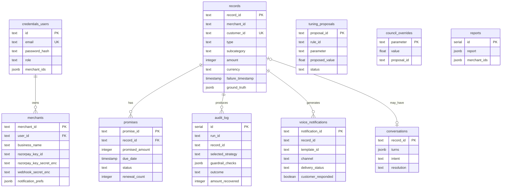

Auth.js adapter tables (`users`, `accounts`, `sessions`, `verification_token`) support Google OAuth and are omitted above for brevity.

| Table | Purpose |
|-------|---------|
| `records` | Recovery records: 150 synthetic rows or live Razorpay imports |
| `promises` | Customer payment promises (from chat parsing) |
| `audit_log` | Append-only decision audit trail |
| `voice_notifications` | Voice channel analytics |
| `tuning_proposals` | Council governance proposals |
| `council_overrides` | Active guardrail overrides |
| `conversations` | Two-way recovery conversations |
| `reports` | Batch report snapshots (JSONB) |
| `credentials_users` | User accounts with roles & merchant access |
| `merchants` | Razorpay-connected businesses with encrypted keys |

---

## Authentication & Tenancy

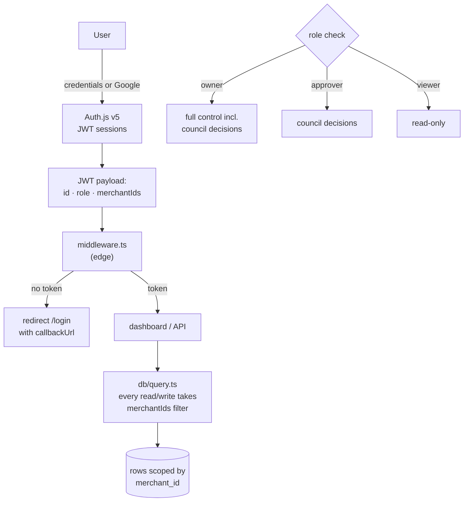

- **Providers:** Google OAuth + email/password (bcrypt-hashed via `credentials_users`).
- **Roles:** `owner`, `approver`, `viewer`. Viewers are read-only; council decisions require `owner` or `approver`.
- **Tenant isolation:** every query in `lib/db/query.ts` accepts the session's `merchantIds` and filters by `merchant_id`. Tests assert merchant A never sees merchant B's rows.
- **Middleware:** edge-compatible JWT check (no DB import) protects all dashboard pages; API routes self-guard with 401s.

---

## Data Flow Diagrams

### Webhook ingestion flow

```mermaid
flowchart TB
    subgraph Razorpay
        RZ["payment.failed · subscription.failed ·<br/>invoice.expired · payment.captured · refund.*"]
    end
    RZ -->|"POST + X-Razorpay-Signature"| VERIFY{"verifyRazorpaySignature<br/>HMAC-SHA256"}
    VERIFY -->|"invalid"| R403["403 rejected"]
    VERIFY -->|"valid"| MAP["mapRazorpayEvent()"]
    MAP -->|"failure events"| INS["upsert into records<br/>merchant-scoped"]
    MAP -->|"captured / refund"| NULLI["ignored (not a leak)"]
    INS --> NEXT["picked up by next batch"]
```

### WhatsApp reply flow

```mermaid
flowchart TB
    CUST["Customer replies<br/>(WhatsApp)"] --> WAH["POST /api/webhooks/whatsapp"]
    WAH --> VER2{"Meta verification"}
    VER2 -->|"invalid"| R403B["403"]
    VER2 -->|"valid"| TURNS["append ConversationTurn"]
    TURNS --> INTENT["classifyIntent() (Hinglish)"]
    INTENT --> RES2["resolution + optional<br/>PromiseRecord / retry"]
    RES2 --> DB3[("conversations table")]
```

### Cron → alert flow

```mermaid
flowchart LR
    VC["Vercel Cron<br/>hourly ('0 * * * *')"] -->|"Bearer CRON_SECRET"| CRON["GET /api/cron/process"]
    CRON --> EXEC["executeBatchRun()"]
    EXEC -->|"200"| OKR["persist report"]
    EXEC -->|"non-200 / throw"| ALERT["sendBatchAlert()"]
    ALERT --> SLA["Slack webhook<br/>and/or Resend email"]
```

---

## Testing

```bash
npm test
```

**18 files · 204 tests**, all hermetic (env vars blanked, SQLite fixture, simulated providers):

| Suite | Covers |
|-------|--------|
| `detection.test.ts` | 4 detectors, subcategories, routing thresholds, feasibility |
| `guardrails.test.ts` | 19 rules, block reasons, config clamping |
| `agent.test.ts` | Pipeline orchestration, outcomes, escalation |
| `council.test.ts` | Proposal generation, suppression rules, decisions |
| `simulator.test.ts` | Determinism, slider clamping, baseline diff |
| `voice.test.ts` | Template selection, IST window, delivery & fallback, metrics |
| `promise-parser.test.ts` | Hinglish promise text → amount + date |
| `promise-tracker.test.ts` | Lifecycle transitions, renewals |
| `promise-escalation.test.ts` | Tier ladder |
| `conversation.test.ts` | Intent classification, resolutions |
| `fleet.test.ts` | Aggregation, ARR projection, fairness flags |
| `generator.test.ts` | Synthetic data reproducibility (seeded RNG) |
| `webhook-notifications.test.ts` | HMAC verification, event mapping, encryption |
| `auth.test.ts` | Session/JWT behavior |
| `security-regression.test.ts` (+ r2) | Post-remediation guarantees, ReDoS, tenant isolation |
| `e2e.test.ts` | Full pipeline end-to-end |

CI runs on every push/PR to `main`: **lint → typecheck → tests → build**, plus a dependency-audit job.

---

## Observability

- **Structured logging:** pino with per-module child loggers (`lib/logger.ts`).
- **Error tracking:** Sentry via `sentry.server.config.ts` + `sentry.edge.config.ts` (only active with a DSN and in production).
- **Health endpoint:** `GET /api/health` reports DB mode (`postgres`/`sqlite`), status, latency, report age, and env flags, and returns 503 when unhealthy.
- **Batch alerts:** failures are pushed to Slack and/or email (`lib/notification/alerts.ts`).
- **Audit log:** every decision is persisted with reasoning, guardrail checks, API call details, outcome, amount, and time-to-recovery.

---

## Security

| Control | Implementation |
|---------|----------------|
| Secret encryption | Razorpay key secrets + webhook secrets encrypted at rest (`lib/crypto.ts`, `enc:v1:` format, random IV) |
| Webhook verification | HMAC-SHA256 signature checks for Razorpay; Meta verification for WhatsApp |
| Tenant isolation | `merchantIds` filter enforced in the query layer + regression tests |
| RBAC | owner / approver / viewer roles enforced on mutations |
| Rate limiting | `lib/ratelimit.ts` on sensitive routes |
| Advisory locking | `lib/lock.ts` prevents concurrent batch double-runs |
| Append-only audit | `audit_log` is written, never updated |
| Security tests | Dedicated regression suites assert all of the above |
| Data retention | Documented in `docs/retention-policy.md` |

A full remediation history is available in [`SECURITY_AUDIT.md`](SECURITY_AUDIT.md).

---

## Contributing

See [CONTRIBUTING.md](CONTRIBUTING.md) for the full guide: fork, branch, `npm test && npm run lint && npm run typecheck`, then open a PR. Please make sure CI-relevant checks pass locally before opening a PR.

---

## License

MIT © 2026 ReviveAI Contributors. See [LICENSE](LICENSE).
